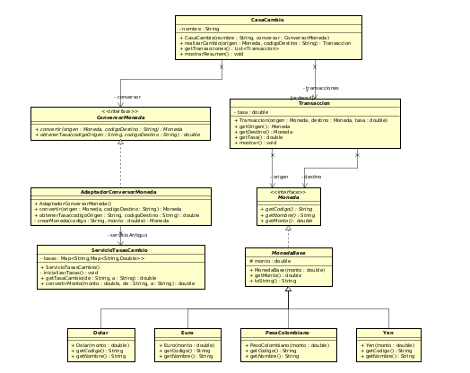
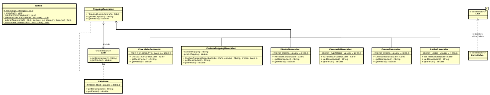

# Laboratorio 3 - Maven

## Integrantes

- Daniel Alexander Ahumada León
- Juan Manuel Neira Zuluaga
- Juan Camilo Torres Suarez

---
## Reto 3: Reino de los vehiculos

### Objetivo

Nosotros implementamos un sistema dedicado a una concesionaria de vehiculos
el cual le va a permitir a los clientes poder seleccionar entre una distinta
gama de vehiculos, y que se le genere una factura con nuestro sistema.

---

### Patron de diseño

En este caso se implemento un patron de diseño creacional. Pues dentro de
la logica del sistema, el cliente va ir analizando el vehiculo que quiere comprar con las caracteristicas que quiera tener

### Patron a usar y Justificación

En este caso se escogio Abstract Factory. Pues porque lo que tenemos
es como un catalogo de vehiculos

### Como lo aplico

En este caso lo que hacemos es crear una dos clases principales. Una interfaz vehiculo y un Main que funcione como interfaz del cliente.
Y de ahi en adelante vamos creando las subclases para cada vehiculo

---

## RETO 4: La Estafa de la Casa de Cambio

**Patrón de Diseño:** Adapter  

---

## Objetivo

Implementar el patrón Adapter para adaptar un servicio antiguo de conversión de monedas (con interfaz incompatible) a un nuevo sistema estándar

---

## Patrón Adapter

### Componentes:

1. **Target (Interfaz objetivo):** `ConversorMoneda`
   - Define la interfaz que el cliente espera usar

2. **Adaptee (Servicio antiguo):** `ServicioTasasCambio`
   - Servicio existente con interfaz incompatible

3. **Adapter:** `AdaptadorConversorMoneda`
   - Adapta ServicioTasasCambio a ConversorMoneda
   - Traduce llamadas entre interfaces

4. **Client:** `CasaCambio`
   - Usa la interfaz ConversorMoneda
   - Desconoce la implementación subyacente

### Problema resuelto:

El antiguo dueño "El Gringo" usaba una sola tasa para todas las conversiones (estafa). Ahora cada par de monedas tiene su tasa real y correcta.

---

## Reto 5: El Café Personalizado

**Patrón de diseño:** Estructural  
**Patrón utilizado:** Decorator  

### Justificación  

Se utilizó el patrón Decorator porque el sistema debe permitir agregar múltiples toppings, salsas y complementos a un café base sin modificar su estructura original.  

Cada topping se implementa como un decorador que envuelve al café y añade comportamiento (descripción y precio adicional). Esto permite combinar múltiples ingredientes dinámicamente, cumplir con el principio Open/Closed y evitar la creación de múltiples subclases para cada combinación posible de café.

